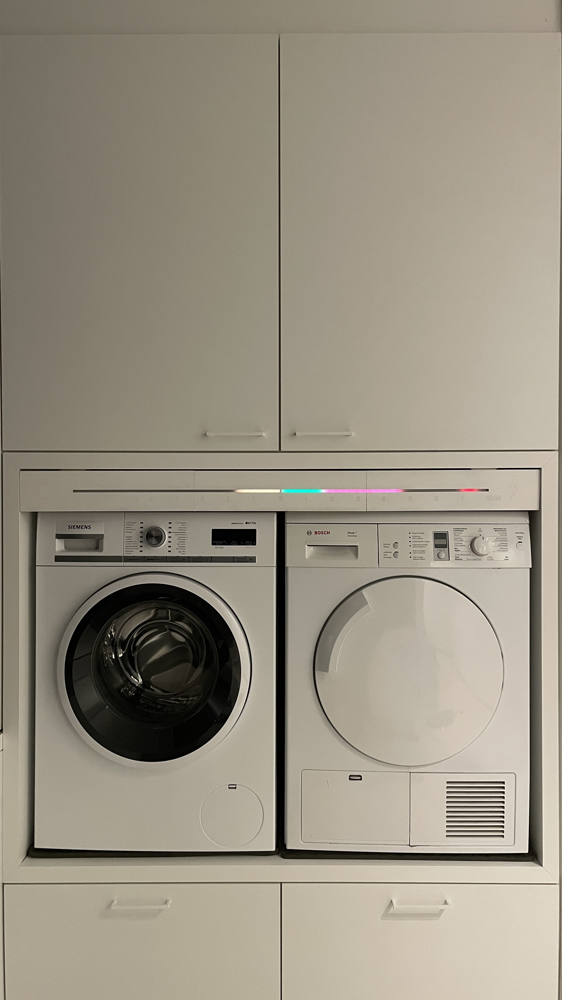
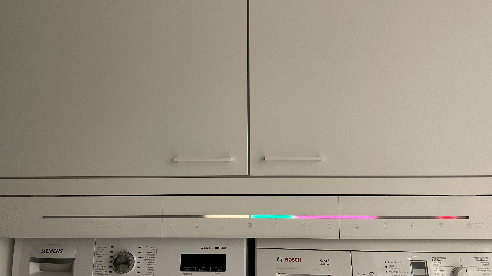
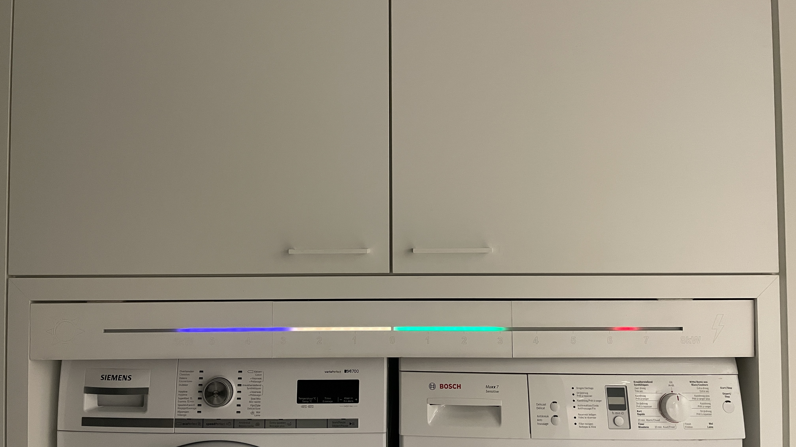
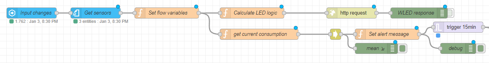
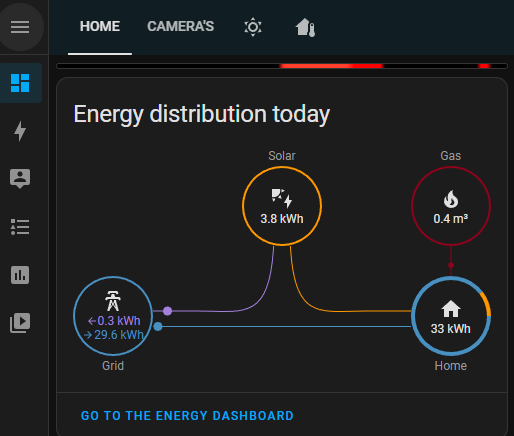

# Real time LED strip energy monitor with peak consumption

## Introduction

I really like the [energy dashboards of Home Assistant](https://www.home-assistant.io/dashboards/energy/). But you do need to open the dashboard on your smartphone or computer to have an idea of the current situation. I wanted to visualize the real time energy consumption and production of my home in order to see the current energy consumption/production at a glance. It allows us to do a quick assessment on whether it is feasible to start a machine.

As of 2023 consumers of the power grid in Belgium will partly be charged based on their monthly peak consumption value (highest mean consumption value in 15m). So it is a matter of keeping the peaks as low as possible.

I wanted to visualize that current monthly peak as well, so we could see how much kW we can consume until we reach the current peak. Luckily the meter recently got an update with these peak values.

## Result

### Overview image

I installed the LED strip above our washing and drying machine:



### Explanation

If you zoom in on the strip you can see the scale.

* From the middle (0kW) to the left (6kW) is the solar production
  * Yellow: solar energy that is self-consumed (always equals the green part of the consumption)
  * Blue: solar energy that is put on the grid (nothing in the above image)
* From the middle (0kW) to the right (scaled to 8kW at the moment) is the total energy consumption of the house
  * Green: solar energy that is self-consumed (=green energy)
  * Red: energy that is pulled of the grid
  * Strong red: the current monthly peak

### Detail

Detail of the LED strip (with simulation values)

* Solar production & self-consumption: 1.7kW
* Net consumption: 3.1kW
* Total energy usage: 4.8kW
* Current peak: 6kW (start from end of self-consumption)



Detail of the LED strip with simulated summer values:

* Solar production: 6kW (3kW self-consumption)
* Net consumption: 0kW
* Total energy usage: 3kW
* Current peak: 3.5kW (start from end of self-consumption)



### Setup

### Sensors

#### Solar production

I have a SMA converter for which I use the "SMA Solar" integration in Home-Assistant. It provides me with _sensor.grid_power_ (had to divide it by 1000 to get the kW values)

#### Digital energy meter

Of course it would have been financially more interesting to have an analogue meter that would count backwards for all solar production, regardless of the production/consumption time. But in return I get some interesting stats now :-)

In order to get the energy values from the meter, I bought a serial cable that I connected to the P1 port (has to be activated on your meter).

I used the [DSMR Slimme Meter](https://www.home-assistant.io/integrations/dsmr) integration with the Belgian V5 version.

With these sensors you can set up the energy dashboard.

The [DSMR parser python library](https://github.com/ndokter/dsmr_parser) recently got [enhanced](https://github.com/ndokter/dsmr_parser/pull/113) with the new peak information values (see [v1.7 of P1 telegram specification](https://maakjemeterslim.be/aanbieder))

I hope it will soon be available as a sensor in Home-Assistant. There is already a [pull request](https://github.com/home-assistant/core/pull/84097) with the version upgrade of dsmr_parser.

### LED strip

The LED strip is set up using:

* [QuinLED Dig Uno v3 DIGITAL LED controller](https://quinled.info/pre-assembled-quinled-dig-uno/)
* WS2812B ECO Led Pixel Strip (60 LEDs per meter)
* DC5V LED Power Supply Adapter
* LED Neon Rope Tube (1m)

It uses the [WLED](https://kno.wled.ge) software that can do some really fancy stuff, but I was only interested in the individual LED light control via their [JSON-API](https://kno.wled.ge/interfaces/json-api/).

#### Front panel

The front was laser cut at a [FabLab](https://fablab-leuven.be/lasercutter/) using a [SVG file as source](img/energiemeter-v1.svg).

### Automation

First I added an automation using the automatization features of Home-Assistant based on example on this forum (forgot the link, I'm sorry).

But now I used node-red to do the automatization.



Whenever the sensor values change, I retrieve their values an calculate the LED strip layout, which I POST to WLED JSON-API.

I also added a notification system to notify me when the current peak value will possibly be reached. I aggregate the current consumption values over 5m. If that value is bigger than the current peak, I send a notification, so we have some time to shut down some machines :-) (although my wife will possibly not do that, but it's the idea that matters)

Node-red source code (CTRL+I to import in node-red)

```json
[{"id":"a7bbd3c76a9f74de","type":"tab","label":"Energy LED strip automation","disabled":true,"info":"","env":[]},{"id":"0f4d945b3064328d","type":"http request","z":"a7bbd3c76a9f74de","name":"","method":"POST","ret":"obj","paytoqs":"ignore","url":"http://127.0.0.1/json/state","tls":"","persist":false,"proxy":"","insecureHTTPParser":false,"authType":"","senderr":false,"headers":[{"keyType":"other","keyValue":"Content-Type","valueType":"other","valueValue":"application/json"}],"x":990,"y":120,"wires":[["6012c78b0d5b6323"]]},{"id":"6012c78b0d5b6323","type":"debug","z":"a7bbd3c76a9f74de","name":"WLED response","active":false,"tosidebar":true,"console":false,"tostatus":false,"complete":"payload","targetType":"msg","statusVal":"","statusType":"auto","x":1180,"y":120,"wires":[]},{"id":"c0e93638a311eb70","type":"ha-get-entities","z":"a7bbd3c76a9f74de","name":"Get sensors","server":"5c504d05eb25139b","version":0,"rules":[{"property":"entity_id","logic":"includes","value":"sensor.power_consumption,sensor.power_production,sensor.grid_power","valueType":"str"}],"output_type":"array","output_empty_results":false,"output_location_type":"msg","output_location":"payload","output_results_count":1,"x":270,"y":120,"wires":[["9c9057273a68ac2a"]]},{"id":"1b03acb34aad3e68","type":"server-state-changed","z":"a7bbd3c76a9f74de","name":"Input changes","server":"5c504d05eb25139b","version":4,"exposeToHomeAssistant":false,"haConfig":[{"property":"name","value":""},{"property":"icon","value":""}],"entityidfilter":["sensor.power_consumption","sensor.power_production","sensor.grid_power"],"entityidfiltertype":"list","outputinitially":false,"state_type":"num","haltifstate":"","halt_if_type":"str","halt_if_compare":"is","outputs":1,"output_only_on_state_change":true,"for":"0","forType":"num","forUnits":"minutes","ignorePrevStateNull":false,"ignorePrevStateUnknown":false,"ignorePrevStateUnavailable":false,"ignoreCurrentStateUnknown":false,"ignoreCurrentStateUnavailable":false,"outputProperties":[{"property":"payload","propertyType":"msg","value":"","valueType":"entityState"},{"property":"data","propertyType":"msg","value":"","valueType":"eventData"},{"property":"topic","propertyType":"msg","value":"","valueType":"triggerId"}],"x":90,"y":120,"wires":[["c0e93638a311eb70"]]},{"id":"9c9057273a68ac2a","type":"function","z":"a7bbd3c76a9f74de","name":"Set flow variables","func":"for (var entity of msg.payload) {\n    flow.set(entity.entity_id, entity.state)\n    //node.warn(entity.entity_id)\n}\n\nflow.set(\"sensor.grid_power\", flow.get(\"sensor.grid_power\")/1000)\n\n//until peak comes from DSMR\n//flow.set(\"peak_kw\", 5.991);\nflow.set(\"peak_kw\", 5.991);\n\nreturn msg;","outputs":1,"noerr":0,"initialize":"","finalize":"","libs":[],"x":470,"y":120,"wires":[["d67498270d41c513","a7020741dae9b4b1"]]},{"id":"d4b6cc437db079e6","type":"function","z":"a7bbd3c76a9f74de","name":"Set alert message","func":"var peak_kw = flow.get(\"peak_kw\");\nvar net_consumption_kw = msg.payload;\n\nif (net_consumption_kw >= peak_kw) {\n    msg.topic = \"Piekvermogen overschreden \" + net_consumption_kw.toFixed(3) + \"kW\";\n    msg.payload = \"Piek (\" + peak_kw.toFixed(3) + \"kW) overschreden. Totaal verbruik: \" + net_consumption_kw.toFixed(3) + \"kW. Verschil van \" + (net_consumption_kw - peak_kw).toFixed(3) + \"kW.\";\n    node.warn(msg.payload);\n    return msg;\n} else {\n    return null;\n}\n\n","outputs":1,"noerr":0,"initialize":"","finalize":"","libs":[],"x":1090,"y":180,"wires":[["276952fa40b10aee","50a028bb9ee3807f"]]},{"id":"276952fa40b10aee","type":"trigger","z":"a7bbd3c76a9f74de","name":"","op1":"","op2":"","op1type":"pay","op2type":"nul","duration":"15","extend":false,"overrideDelay":false,"units":"min","reset":"","bytopic":"all","topic":"topic","outputs":1,"x":1290,"y":160,"wires":[["2846ef92895a30e2"]]},{"id":"50a028bb9ee3807f","type":"debug","z":"a7bbd3c76a9f74de","name":"debug","active":true,"tosidebar":true,"console":false,"tostatus":false,"complete":"payload","targetType":"msg","statusVal":"","statusType":"auto","x":1290,"y":220,"wires":[]},{"id":"d67498270d41c513","type":"function","z":"a7bbd3c76a9f74de","name":"Calculate LED logic","func":"var net_production_kw = flow.get(\"sensor.power_production\");\nvar net_consumption_kw = flow.get(\"sensor.power_consumption\");\nvar self_consumption_kw = flow.get(\"sensor.grid_power\") - flow.get(\"sensor.power_production\");\nvar peak_kw = flow.get(\"peak_kw\");\n\n/* demo data */\n/*\nnet_production_kw = 3;\nnet_consumption_kw = 0;\nself_consumption_kw = 3;\npeak_kw = 3.5;\n*/\n\n\nvar solar_leds = [];\nvar power_leds = [];\n\n/* colors */\nvar color_white = [0,0,0];\nvar color_solar_self = [255, 204, 0];\nvar color_solar_net  = [148, 0, 211];\nvar color_power_self = [0, 255, 0];\nvar color_power_net  = [248, 131, 121];\nvar color_power_peak = [255, 0, 0];\n\n\nvar leds_total = 60;\nvar max_kw = 8;\nvar max_solar_kw = 6;\n\nvar brightness = 20;\n\nvar leds_power = (leds_total / (max_kw + max_solar_kw)) * max_kw;\nvar leds_solar = (leds_total / (max_kw + max_solar_kw)) * max_solar_kw;\n\nvar net_production_leds = Math.round(net_production_kw * leds_solar / max_solar_kw);\nvar net_consumption_leds = Math.round(net_consumption_kw * leds_power / max_kw);\nvar self_consumption_leds = Math.round(self_consumption_kw * leds_solar / max_solar_kw);\nvar total_consumption_leds = self_consumption_leds + net_consumption_leds;\n//peak is always taken from net, so self_consumption must be added\nvar peak_led = Math.round((peak_kw + self_consumption_kw) * leds_power / max_kw);\n\n/*\nnode.log(\"Production (net): \" + net_production_leds);\nnode.log(\"Consumption (self): \" + self_consumption_leds);\nnode.log(\"Consumption (net): \" + net_consumption_leds);\nnode.log(\"Consumption (total): \" + total_consumption_leds);\nnode.log(\"Peak: \" + peak_led);\n*/\n\nsolar_leds.push(0, leds_solar, color_white);\nsolar_leds.push(0, self_consumption_leds, color_solar_self);\nsolar_leds.push(self_consumption_leds, (self_consumption_leds + net_production_leds), color_solar_net);\n\npower_leds.push(0, leds_power, color_white);\nif (peak_led > self_consumption_leds && peak_led < total_consumption_leds) {\n    power_leds.push(0, self_consumption_leds, color_power_self);\n    power_leds.push(self_consumption_leds, peak_led, color_power_net);\n    power_leds.push(peak_led, total_consumption_leds, color_power_peak);\n} else if (peak_led >= total_consumption_leds) {\n    power_leds.push(0, self_consumption_leds, color_power_self);\n    power_leds.push(self_consumption_leds, total_consumption_leds, color_power_net);\n    power_leds.push(peak_led, (peak_led+1), color_power_peak);\n} \n\nvar result = {};\nresult.bri = brightness;\n\nvar solar_segment = {};\nsolar_segment.id=0;\nsolar_segment.start=0;\nsolar_segment.stop=leds_solar;\nsolar_segment.len=leds_solar;\nsolar_segment.rev=true;\nsolar_segment.i= solar_leds;\n\nvar power_segment = {};\npower_segment.id = 1;\npower_segment.start = leds_solar;\npower_segment.stop = leds_total;\npower_segment.len = (leds_total - leds_solar);\npower_segment.rev = false;\npower_segment.i = power_leds;\n\nresult.seg = [];\nresult.seg.push(solar_segment);\nresult.seg.push(power_segment);\n\n//node.log(JSON.stringify(result));\nmsg.payload = result;\n\nreturn msg;","outputs":1,"noerr":0,"initialize":"","finalize":"","libs":[],"x":710,"y":120,"wires":[["0f4d945b3064328d"]]},{"id":"c9452ab785cfc621","type":"aggregator","z":"a7bbd3c76a9f74de","name":"","topic":"","intervalCount":"5","intervalUnits":"m","submitIncompleteInterval":true,"submitPerTopic":false,"aggregationType":"mean","x":905,"y":180,"wires":[["d4b6cc437db079e6","1b63a2db93d7c207"]],"l":false},{"id":"a7020741dae9b4b1","type":"function","z":"a7bbd3c76a9f74de","name":"get current consumption","func":"msg.payload = flow.get(\"sensor.power_consumption\");\nreturn msg;","outputs":1,"noerr":0,"initialize":"","finalize":"","libs":[],"x":730,"y":180,"wires":[["c9452ab785cfc621"]]},{"id":"1b63a2db93d7c207","type":"debug","z":"a7bbd3c76a9f74de","name":"mean","active":true,"tosidebar":true,"console":true,"tostatus":false,"complete":"payload","targetType":"msg","statusVal":"","statusType":"auto","x":1060,"y":220,"wires":[]},{"id":"2846ef92895a30e2","type":"debug","z":"a7bbd3c76a9f74de","name":"notify...","active":true,"tosidebar":true,"console":false,"tostatus":false,"complete":"payload","targetType":"msg","statusVal":"","statusType":"auto","x":1460,"y":160,"wires":[]},{"id":"5c504d05eb25139b","type":"server","name":"Home Assistant","version":5,"addon":false,"rejectUnauthorizedCerts":true,"ha_boolean":"y|yes|true|on|home|open","connectionDelay":true,"cacheJson":true,"heartbeat":false,"heartbeatInterval":"30","areaSelector":"friendlyName","deviceSelector":"friendlyName","entitySelector":"friendlyName","statusSeparator":": ","statusYear":"hidden","statusMonth":"short","statusDay":"numeric","statusHourCycle":"default","statusTimeFormat":"h:m","enableGlobalContextStore":false}]
```

### WLED strip visualized in Home-Assistant dashboard

As you can see, the strip is installed above our washing and drying machine. For development purposes, it was extremely helpful to visualize the LED via: <http://WLED_IP/liveview>

Home-Assistant provides a simple card to add a webpage to a card, so I could visualize the LED strip on my HASS dashboard:



I hope it can be of use to someone!
